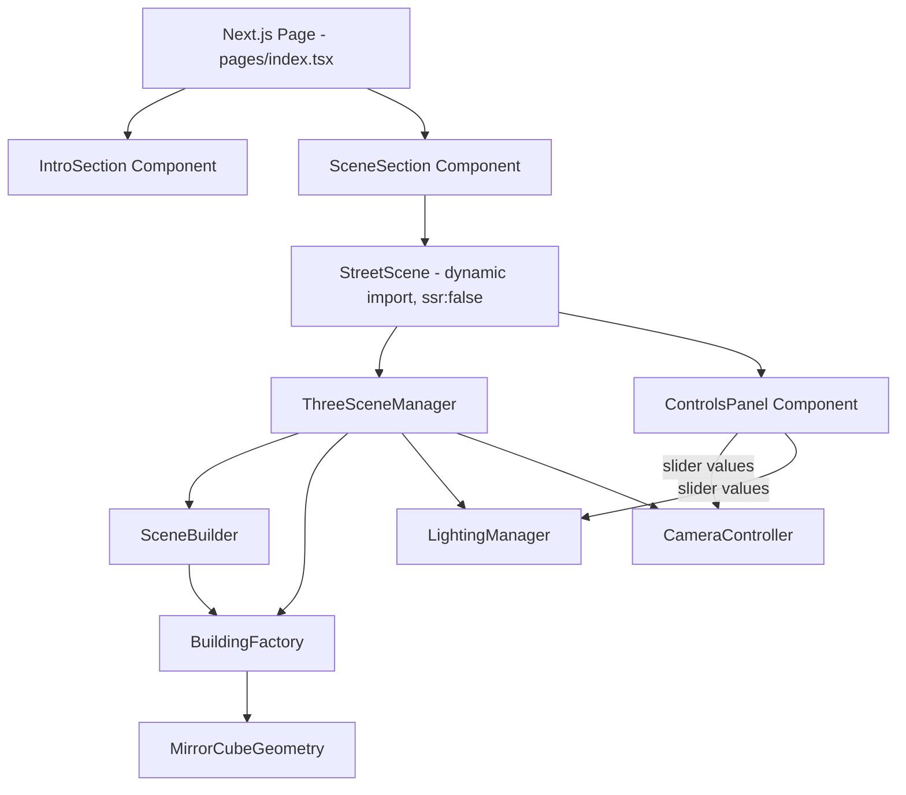

# Design Document: Rubic's Street

## Overview

Rubic's Street is a single-page Next.js application that combines a static introductory section with an interactive Three.js 3D scene. The page tells a visual story: buildings shaped like mirror cubes line an uphill street, transitioning from chaotic unsolved geometry at the bottom to clean solved geometry at the top.

The application has two distinct rendering layers:

1. **React/HTML layer** — the introductory section (title, subtitle, sketch image, Erno Rubik text) rendered as standard DOM elements with the e-ink grayscale aesthetic.
2. **Three.js/WebGL layer** — the 3D street scene rendered into a `<canvas>` element, with a React-managed controls panel overlaid on top.

The architecture keeps Three.js entirely client-side. Because Next.js performs server-side rendering, all Three.js initialization is deferred to `useEffect` hooks (or a dynamically imported component with `ssr: false`) to avoid `window`/`document` access during SSR.

### Key Design Decisions

- **No React Three Fiber**: The requirements specify Three.js directly. Using raw Three.js gives full control over the render loop and geometry construction without an additional abstraction layer.
- **Dynamic import for the 3D canvas**: The Three.js component is loaded with `next/dynamic` and `{ ssr: false }` to prevent SSR errors.
- **Geometry merging per building**: Each building's 27 cuboid pieces are merged into a single `BufferGeometry` using `BufferGeometryUtils.mergeGeometries`. This reduces draw calls from 27 × 12 = 324 to 12 per frame.
- **Interpolated geometry, not shader morphing**: Solve_Progress interpolation is computed on the CPU at build time (when the scene is initialized). Buildings do not animate; their geometry is fixed at the assigned Solve_Progress value. This keeps the render loop simple and performant.

---

## Architecture



### Module Responsibilities

| Module | Responsibility |
|---|---|
| `pages/index.tsx` | Page entry point; composes IntroSection and SceneSection |
| `components/IntroSection.tsx` | Title, subtitle, sketch image, Erno Rubik text |
| `components/SceneSection.tsx` | Wrapper div that hosts the canvas and controls panel |
| `components/StreetScene.tsx` | Dynamically imported; owns the Three.js lifecycle |
| `components/ControlsPanel.tsx` | Five labeled sliders; pure React, no Three.js dependency |
| `lib/ThreeSceneManager.ts` | Initializes renderer, scene, camera; owns the animation loop |
| `lib/SceneBuilder.ts` | Constructs street geometry, places buildings |
| `lib/BuildingFactory.ts` | Creates a single building mesh at a given Solve_Progress |
| `lib/MirrorCubeGeometry.ts` | Generates the merged BufferGeometry for a mirror cube |
| `lib/LightingManager.ts` | Manages ambient + directional lights; exposes sun position API |
| `lib/CameraController.ts` | Translates slider values into camera position/rotation |

---

## Components and Interfaces

### ControlsPanel

```typescript
interface SliderConfig {
  id: string;
  label: string;
  min: number;
  max: number;
  step: number;
  defaultValue: number;
}

interface ControlsPanelProps {
  onStreetPositionChange: (value: number) => void;      // 0.0 – 1.0
  onCameraHRotationChange: (value: number) => void;     // 0° – 360°
  onCameraVTiltChange: (value: number) => void;         // -20° – +60°
  onSunAzimuthChange: (value: number) => void;          // 0° – 360°
  onSunElevationChange: (value: number) => void;        // 0° – 90°
}
```

Default values:
- Street Position: `0.0`
- Camera H Rotation: computed from uphill direction (see CameraController)
- Camera V Tilt: `10`
- Sun Azimuth: `135` (southeast, a natural default)
- Sun Elevation: `45`

### ThreeSceneManager

```typescript
interface SceneManagerOptions {
  canvas: HTMLCanvasElement;
  onReady?: () => void;
}

class ThreeSceneManager {
  constructor(options: SceneManagerOptions);
  setStreetPosition(t: number): void;       // 0.0 – 1.0
  setCameraHRotation(deg: number): void;    // 0 – 360
  setCameraVTilt(deg: number): void;        // -20 – +60
  setSunAzimuth(deg: number): void;         // 0 – 360
  setSunElevation(deg: number): void;       // 0 – 90
  handleResize(): void;
  dispose(): void;
}
```

### MirrorCubeGeometry

```typescript
interface PieceSize {
  x: number;
  y: number;
  z: number;
}

interface MirrorCubeConfig {
  solveProgress: number;   // 0.0 – 1.0
  totalSize: number;       // overall bounding box side length (world units)
}

function buildMirrorCubeGeometry(config: MirrorCubeConfig): THREE.BufferGeometry;
```

### BuildingFactory

```typescript
interface BuildingOptions {
  solveProgress: number;   // 0.0 – 1.0
  side: 'left' | 'right';
  index: number;           // 0 (downhill) – 5 (uphill)
}

function createBuilding(options: BuildingOptions): THREE.Mesh;
```

### LightingManager

```typescript
class LightingManager {
  constructor(scene: THREE.Scene);
  setAzimuth(deg: number): void;
  setElevation(deg: number): void;
}
```

Sun position is computed from azimuth and elevation using spherical-to-Cartesian conversion:

```
x = cos(elevation) * sin(azimuth)
y = sin(elevation)
z = cos(elevation) * cos(azimuth)
```

The `DirectionalLight.position` is set to this vector (scaled to a large radius), and `DirectionalLight.target` remains at the scene origin.

### CameraController

```typescript
class CameraController {
  constructor(camera: THREE.PerspectiveCamera, streetPath: THREE.CatmullRomCurve3);
  setStreetPosition(t: number): void;
  setHRotation(deg: number): void;
  setVTilt(deg: number): void;
}
```

The camera's world position is derived from `streetPath.getPoint(t)`. The base look direction is the street tangent at `t`. H rotation is applied as a yaw offset around the world Y axis; V tilt is applied as a pitch offset.

---

## Data Models

### Mirror Cube Piece Layout

A mirror cube is a 3×3×3 arrangement of 27 cuboid pieces. In the **solved state**, all pieces are uniform — each has the same dimensions, and together they form a perfect rectangular prism. In the **unsolved state**, each piece has distinct, non-uniform dimensions that sum to the same total bounding box but create an irregular silhouette.

#### Piece Size Definition

The 3×3×3 grid is indexed `(i, j, k)` where each index is 0, 1, or 2 along the X, Y, Z axes respectively.

For each axis, three "slice widths" are defined:
- **Solved**: `[1/3, 1/3, 1/3]` × `totalSize` — uniform slices
- **Unsolved**: `[a, b, c]` × `totalSize` where `a + b + c = 1` and `a ≠ b ≠ c` — non-uniform slices

Example unsolved slice ratios (normalized to sum to 1.0):
- X axis: `[0.20, 0.45, 0.35]`
- Y axis: `[0.15, 0.55, 0.30]`
- Z axis: `[0.25, 0.40, 0.35]`

#### Interpolation

At a given `solveProgress` value `t` (0.0 → 1.0), each slice width is linearly interpolated:

```
sliceWidth(t) = lerp(unsolvedWidth, solvedWidth, t)
             = unsolvedWidth * (1 - t) + solvedWidth * t
```

This produces a smooth geometric transition from irregular to uniform.

#### Piece Position

Each piece's center position is computed from the cumulative sum of slice widths along each axis, offset so the overall bounding box is centered at the origin:

```
centerX(i) = -totalSize/2 + sum(sliceX[0..i-1]) + sliceX[i]/2
```

#### Geometry Construction

For each of the 27 pieces:
1. Create a `THREE.BoxGeometry(w, h, d)` with the piece's interpolated dimensions.
2. Apply a `Matrix4` translation to position it at its center.
3. Collect all 27 geometries and merge them with `BufferGeometryUtils.mergeGeometries`.

The result is a single `BufferGeometry` representing the entire building.

### Street Path

The street is defined as a `THREE.CatmullRomCurve3` with control points that rise in Y from the camera end to the far end, creating the uphill slope:

```typescript
const streetPath = new THREE.CatmullRomCurve3([
  new THREE.Vector3(0, 0, 0),          // downhill end (camera start)
  new THREE.Vector3(0, 2, -20),        // mid-slope
  new THREE.Vector3(0, 5, -50),        // uphill end
]);
```

The road surface mesh is a `PlaneGeometry` subdivided along the Z axis and displaced in Y to follow the curve.

### Building Placement

Buildings are placed at evenly spaced `t` values along the street path:

```typescript
const buildingTs = [1/12, 3/12, 5/12, 7/12, 9/12, 11/12]; // 6 positions
```

For each `t`, the street path provides a world position. Buildings are offset laterally (±X) from the path center by a fixed `streetWidth / 2 + buildingOffset` distance.

The `solveProgress` for building at index `i` (0 = downhill, 5 = uphill):

```typescript
const solveProgress = i / 5;  // 0.0, 0.2, 0.4, 0.6, 0.8, 1.0
```

Both left and right buildings at the same index share the same `solveProgress`.

### Scene Graph Summary

```
Scene
├── AmbientLight (grayscale, low intensity)
├── DirectionalLight (grayscale, casts shadows)
├── RoadMesh (PlaneGeometry, grayscale MeshLambertMaterial)
├── BuildingGroup_Left
│   ├── Building_L0 (solveProgress=0.0)
│   ├── Building_L1 (solveProgress=0.2)
│   ├── Building_L2 (solveProgress=0.4)
│   ├── Building_L3 (solveProgress=0.6)
│   ├── Building_L4 (solveProgress=0.8)
│   └── Building_L5 (solveProgress=1.0)
└── BuildingGroup_Right
    ├── Building_R0 (solveProgress=0.0)
    ├── Building_R1 (solveProgress=0.2)
    ├── Building_R2 (solveProgress=0.4)
    ├── Building_R3 (solveProgress=0.6)
    ├── Building_R4 (solveProgress=0.8)
    └── Building_R5 (solveProgress=1.0)
```

### Material Strategy

All materials use `THREE.MeshLambertMaterial` with grayscale colors only:

| Element | Color | Notes |
|---|---|---|
| Building (unsolved, faces) | `#888888` | Mid-gray; irregular faces catch light differently |
| Building (solved, faces) | `#CCCCCC` | Light gray; uniform faces read as simpler |
| Building (interpolated) | `lerp(#888888, #CCCCCC, t)` | Grayscale lerp by solveProgress |
| Road surface | `#444444` | Dark gray, distinct from buildings |
| Ambient light | `#FFFFFF`, intensity 0.4 | Fills shadows without washing out depth |
| Directional light | `#FFFFFF`, intensity 0.8 | Primary shading source |

Because all 27 pieces of a building share the same material, the merged geometry approach works cleanly — one draw call per building.

### Page Layout and Styling

The page uses a CSS custom property for the grayscale palette:

```css
:root {
  --bg: #F5F5F5;
  --text: #111111;
  --accent: #555555;
  --canvas-bg: #E8E8E8;
}
```

The `IntroSection` is a standard HTML flow layout. The `SceneSection` is a `position: relative` container; the canvas fills it absolutely, and the `ControlsPanel` is positioned as an overlay (e.g., bottom-left or right side).

The "Caveat" font is loaded via a `<link>` in `_document.tsx` (or `app/layout.tsx` for the App Router):

```html
<link
  href="https://fonts.googleapis.com/css2?family=Caveat:wght@400;700&display=swap"
  rel="stylesheet"
/>
```

Font fallback in CSS:

```css
.title {
  font-family: 'Caveat', cursive;
}
```

---

## Correctness Properties

*A property is a characteristic or behavior that should hold true across all valid executions of a system — essentially, a formal statement about what the system should do. Properties serve as the bridge between human-readable specifications and machine-verifiable correctness guarantees.*

### Property 1: Mirror Cube Geometry Piece Count

*For any* `solveProgress` value in [0.0, 1.0], `buildMirrorCubeGeometry` shall produce a merged `BufferGeometry` whose vertex count equals exactly 27 times the vertex count of a single `BoxGeometry` (i.e., the geometry is always composed of exactly 27 cuboid pieces).

**Validates: Requirements 4.2**

---

### Property 2: Piece Dimension Interpolation

*For any* `solveProgress` value `t` in [0.0, 1.0] and for any piece `(i, j, k)` in the 3×3×3 grid, the piece's width along each axis shall equal `lerp(unsolvedWidth, solvedWidth, t)` within floating-point tolerance. At `t = 0.0` the dimensions match the unsolved ratios exactly; at `t = 1.0` all pieces are uniform (each axis slice = `totalSize / 3`).

**Validates: Requirements 4.3, 4.4, 4.5**

---

### Property 3: Even Building Spacing

*For any* side of the street (left or right), the distances between consecutive building positions along the street path shall all be equal within floating-point tolerance. That is, for buildings at positions `p[0]` through `p[5]`, `|p[1]-p[0]| ≈ |p[2]-p[1]| ≈ ... ≈ |p[5]-p[4]|`.

**Validates: Requirements 3.3**

---

### Property 4: Monotonically Increasing Solve Progress

*For any* sequence of buildings ordered from downhill (index 0) to uphill (index 5), the `solveProgress` values shall form a strictly monotonically increasing sequence: `solveProgress[i] < solveProgress[i+1]` for all `i` in [0, 4]. The first building shall have `solveProgress = 0.0` and the last shall have `solveProgress = 1.0`.

**Validates: Requirements 5.1, 5.2, 5.3, 5.4**

---

### Property 5: Left-Right Solve Progress Symmetry

*For any* building index `i` in [0, 5], the left-side building at index `i` and the right-side building at index `i` shall have identical `solveProgress` values.

**Validates: Requirements 5.5**

---

### Property 6: Grayscale Invariant

*For any* color value used in the application — whether a Three.js material color, a CSS color property on any page element, or a slider/control color — the red, green, and blue components shall be equal (R = G = B), confirming the value is a pure grayscale with no hue.

**Validates: Requirements 6.1, 6.3, 9.3**

---

### Property 7: Street Path Rises Monotonically

*For any* two parameter values `t1 < t2` in [0.0, 1.0], the Y coordinate of `streetPath.getPoint(t1)` shall be less than or equal to the Y coordinate of `streetPath.getPoint(t2)`. The street never dips downward as it progresses from the camera toward the uphill end.

**Validates: Requirements 7.2**

---

### Property 8: Camera Position Follows Street Path

*For any* `streetPosition` value `t` in [0.0, 1.0], after calling `cameraController.setStreetPosition(t)`, the camera's world position shall equal `streetPath.getPoint(t)` within floating-point tolerance.

**Validates: Requirements 9.4**

---

### Property 9: Camera Orientation Matches Slider Values

*For any* horizontal rotation angle `h` in [0°, 360°] and vertical tilt angle `v` in [−20°, +60°], after calling `setCameraHRotation(h)` and `setCameraVTilt(v)`, the camera's look direction shall correspond to a yaw of `h` degrees and a pitch of `v` degrees from the base street-tangent direction, within floating-point tolerance.

**Validates: Requirements 9.5, 9.7**

---

### Property 10: Sun Position Matches Azimuth and Elevation

*For any* azimuth `az` in [0°, 360°] and elevation `el` in [0°, 90°], after calling `lightingManager.setAzimuth(az)` and `lightingManager.setElevation(el)`, the directional light's position vector shall equal the spherical-to-Cartesian result:
- `x = cos(el_rad) * sin(az_rad)`
- `y = sin(el_rad)`
- `z = cos(el_rad) * cos(az_rad)`

within floating-point tolerance (where `az_rad = az * π/180` and `el_rad = el * π/180`).

**Validates: Requirements 9.9, 9.10**

---

## Error Handling

### WebGL Unavailable

When `THREE.WebGLRenderer` throws during initialization (browser lacks WebGL support), the `StreetScene` component catches the error and renders a fallback `<div>` with the message: *"This experience requires a WebGL-capable browser. Please try Chrome, Firefox, Safari, or Edge."*

Implementation pattern:

```typescript
useEffect(() => {
  try {
    const manager = new ThreeSceneManager({ canvas: canvasRef.current! });
    sceneManagerRef.current = manager;
  } catch (e) {
    setWebGLError(true);
  }
}, []);
```

### Font Load Failure

The CSS `font-family` declaration always includes `cursive` as a fallback after `'Caveat'`. If the Google Fonts CDN is unreachable, the browser automatically uses the system cursive font. No JavaScript error handling is needed.

### Image Load Failure

The `` element for the sketch image includes a descriptive `alt` attribute. If the image fails to load, the browser renders the alt text. Optionally, an `onError` handler can swap in a styled placeholder `<div>`.

### Resize Handling

The `ThreeSceneManager` attaches a `ResizeObserver` to the canvas container (not `window.resize`) for more reliable size tracking. On resize:

```typescript
resizeObserver = new ResizeObserver(() => {
  const { width, height } = container.getBoundingClientRect();
  renderer.setSize(width, height);
  camera.aspect = width / height;
  camera.updateProjectionMatrix();
});
```

### Cleanup / Memory Leaks

On component unmount, `ThreeSceneManager.dispose()` cancels the animation frame, disposes all geometries and materials, and disconnects the `ResizeObserver`. This prevents memory leaks during Next.js hot module replacement in development.

---

## Testing Strategy

### Dual Testing Approach

The testing strategy combines unit/example-based tests for specific behaviors with property-based tests for universal invariants.

**Property-Based Testing Library**: [fast-check](https://github.com/dubzzz/fast-check) (TypeScript-native, well-maintained, works in Jest/Vitest environments).

**Test Runner**: Vitest (compatible with Next.js, fast, TypeScript-native).

### Property-Based Tests

Each property test runs a minimum of **100 iterations** with randomly generated inputs. Each test is tagged with a comment referencing the design property.

| Property | Test Description | Generators |
|---|---|---|
| Property 1 | Mirror cube has 27 pieces for any solveProgress | `fc.float({ min: 0, max: 1 })` |
| Property 2 | Piece dimensions interpolate correctly | `fc.float({ min: 0, max: 1 })`, piece index `fc.integer({ min: 0, max: 2 })` |
| Property 3 | Building spacing is even | Fixed scene; verify spacing array |
| Property 4 | SolveProgress is monotonically increasing | Fixed scene; verify sequence |
| Property 5 | Left/right symmetry | Fixed scene; verify pairs |
| Property 6 | All colors are grayscale | `fc.integer({ min: 0, max: 255 })` for material color inputs |
| Property 7 | Street path rises monotonically | `fc.float({ min: 0, max: 1 })` pairs |
| Property 8 | Camera position follows street path | `fc.float({ min: 0, max: 1 })` |
| Property 9 | Camera orientation matches sliders | `fc.float({ min: 0, max: 360 })`, `fc.float({ min: -20, max: 60 })` |
| Property 10 | Sun position matches azimuth/elevation | `fc.float({ min: 0, max: 360 })`, `fc.float({ min: 0, max: 90 })` |

Tag format for each test:
```typescript
// Feature: rubics-street, Property N: <property_text>
```

### Unit / Example-Based Tests

| Requirement | Test |
|---|---|
| 1.1 | IntroSection renders before SceneSection in DOM |
| 1.2 | Title text is "Rubic's Street Idea" with Caveat font-family |
| 1.3 | Subtitle text is "by Vit Komenda" with smaller font size |
| 1.4 | Sketch image element is present with correct src |
| 1.5 | Intro paragraph contains key phrases about Erno Rubik |
| 1.8 | Sketch image has non-empty alt attribute |
| 2.3 | Resize handler updates canvas size and camera aspect ratio |
| 2.4 | WebGL unavailable → fallback message rendered |
| 6.2 | Background color ≤ #DDDDDD; text color ≥ #222222 |
| 6.4 | Unsolved building material color differs from solved building |
| 6.5 | Road material color differs from building material colors |
| 9.1 | ControlsPanel is present in SceneSection, not IntroSection |
| 9.2 | ControlsPanel contains exactly 5 slider inputs |
| 9.6 | H rotation slider initializes at uphill-facing value |
| 9.8 | V tilt slider initializes at 10° |
| 9.11 | Sun elevation slider initializes at 45° |
| 9.12 | Each slider has an adjacent label element |
| 9.13 | Slider onChange calls scene update synchronously |

### Smoke Tests

| Requirement | Test |
|---|---|
| 1.6 | Document head contains Google Fonts link for Caveat |
| 1.7 | Title CSS font-family includes 'cursive' fallback |
| 2.1 | Canvas element exists and is sized to viewport |
| 2.2 | Renderer is WebGLRenderer with correct pixel ratio |
| 3.1 | Road mesh exists in scene graph after initialization |
| 3.2 | Scene contains exactly 12 building meshes |
| 3.4 | Camera initial position matches downhill end of street path |
| 4.1 | Each building is a THREE.Mesh with non-null geometry |
| 6.6 | Scene contains AmbientLight and DirectionalLight with positive intensity |
| 7.1 | Camera FOV is between 45 and 75 degrees |
| 7.3 | Camera is a PerspectiveCamera (not OrthographicCamera) |
| 8.1 | Next.js build succeeds with no server-side dependencies |

### Testing Notes

- Three.js objects are tested in a Node.js environment using `jsdom` for DOM APIs and a mock WebGL context (e.g., `jest-canvas-mock` or `vitest-canvas-mock`).
- `MirrorCubeGeometry`, `LightingManager`, and `CameraController` are pure TypeScript modules with no DOM dependency — they can be tested directly without mocking.
- React components (`IntroSection`, `ControlsPanel`) are tested with `@testing-library/react`.
- The `ThreeSceneManager` integration tests require a mock canvas and WebGL context.
